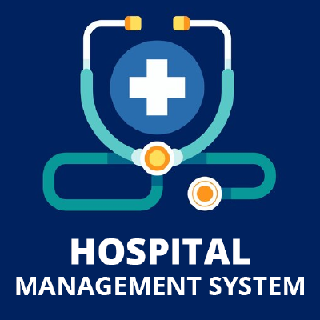

<div align="center">
  <h1>Hospital Management System</h1>
  
</div>

The Hospital Management System is a Qt-based C++ application for managing patients, staff, billing, and medication logistics across a network of hospitals. It offers a clean tabbed interface for efficient hospital administration, supporting tasks like patient tracking, doctor/nurse assignment, billing, and pharmacy coordination.

## Team Members
- Cameron Vandermeersch
- Nafiz Hasan
- Ahmad Munim

This project was developed as part of a university course Comp - 3400 Object Oriented Programming 
in C++. The goal was to create a comprehensive hospital management system that adheres to object-oriented principles and provides a user-friendly interface for managing hospital operations that meets the requirements provided.

---

## Table of Contents
- [GitHub Repository](#github-repository)
- [Setup and Configuration](#setup-and-configuration)
- [Getting Started](#getting-started)
- [System Architecture](#system-architecture)
- [Main Features](#main-features)
- [User Interface Overview](#user-interface-overview)
- [How to Test the Application](#how-to-test-the-application)
- [Sample Data](#sample-data)
- [Technical Documentation](#technical-documentation)
- [System Requirements and Constraints](#system-requirements-and-constraints)
- [Troubleshooting](#troubleshooting)
- [Future Development](#future-development)
- [Team Contribution](#team-contribution)
- [License](#license)

---

## GitHub Repository

The project is available on GitHub at [Hospital Management System](https://github.com/Hospital-Management-System-Project/HospitalManagementSystem).

### Clone the Repository
```bash
# Clone the repository
git clone https://github.com/Hospital-Management-System-Project/HospitalManagementSystem.git

# Navigate to the project directory
cd HospitalManagementSystem
```

### Setup and Configuration
1. Make sure Qt is installed on your system 
    - For Windows, install Qt via the Qt Online Installer
    - For Linux, install Qt using your package manager (e.g., `sudo apt-get install qt5-default`)
    - For macOS, install Qt using Homebrew (`brew install qt`)
2. Open the project using Qt Creator or your preferred IDE
3. Configure the build settings according to your environment
4. Build the project using the instructions below

---

## Getting Started

### Prerequisites
- Qt 5.x or newer
- C++11 or newer compiler support
- C++ compiler (e.g., GCC, Clang, or MSVC)
- `make` or a compatible build tool

### Build & Run

#### Option 1: Using Qt Creator
1. Open **Qt Creator**
2. Go to **File > Open File or Project...**
3. Select `HospitalManagementSystem.pro` from the project folder
4. Configure the project if prompted
5. Click **Build** and then **Run**

#### Option 2: Using Command Line
```bash
# Navigate to the project directory
cd /path/to/HospitalManagementSystem

# Generate Makefile
qmake HospitalManagementSystem.pro

# Compile the project
make

# Run the application
./HospitalManagementSystem         # Linux/macOS
open HospitalManagementSystem.app  # macOS
HospitalManagementSystem.exe       # Windows
```

---

## System Architecture

The system follows the Model-View-Controller (MVC) pattern:

- **Model**: Core logic in C++ classes like `Hospital`, `Patient`, `Doctor`, `Nurse`, `Pharmacy`, and `Drug`
- **View & Controller**: Qt-based GUI (`MainWindow`) with a tabbed interface
- **Controllers**: Singleton managers `HospitalSystem` and `PharmacySystem` coordinate global operations

---

### Core OOP Principles
- **Encapsulation**: All class attributes are private, accessed via getters/setters (e.g., `getDoctorID()`, `getHospitalID()`).
- **Composition**: Hospitals manage collections of `Patient`, `Doctor`, and `Nurse` objects; `Pharmacy` manages `Drug` and `Bill` objects.
- **Modular Classes**: Each class (e.g., `Patient`, `Doctor`, `Hospital`, `Pharmacy`) has a focused responsibility and minimal dependencies.
- **Singleton Pattern**: `HospitalSystem` and `PharmacySystem` are global managers used to coordinate application-wide logic from any part of the code.

---

## Main Features

### Patient Management
- Admit, relocate, discharge patients across hospitals
- View individual patient details and status

### Doctor Management
- View, add, remove, and relocate doctors
- Assign primary and attending doctors to patients
- Allow doctors to request discharges

### Nurse Management
- View, add, remove, and relocate nurses
- Assign nurses (max 2 patients per nurse)

### Billing System
- Daily charges update automatically
- Accept partial/full payments
- Generate reports for patients and hospitals

### Pharmacy Integration
- Request medications from pharmacies
- Track and pay pharmacy-related bills

### Hospital Network
- Manage staff/patient lists per hospital
- Monitor capacity and workload

### Real-Time Updates
- Automated daily updates for billing and patient stay tracking using Qt timers

---

## User Interface Overview

The interface is organized into the following tabs:
- **Patient Management**: Admit, relocate, discharge patients
- **Doctor Management**: Add, remove, view, or reassign doctors
- **Nurse Management**: Add, remove, view, or reassign nurses
- **Doctor-Patient**: Assign doctors, set primary doctors, request discharges
- **Nurse-Patient**: Assign nurses to patients
- **Billing**: View/calculate bills, collect payments, generate reports
- **Drug Delivery**: Order medications and track hospital pharmacy bills

---

## How to Test the Application

### 1. Add a Patient
- Fill in patient details
- Choose hospital, doctor, and nurse
- Set daily billing rate
- Click **"Add Patient"**

### 2. Assign a Doctor
- Go to the **Doctor-Patient** tab
- Enter doctor and patient IDs
- Click **"Assign Doctor"** or **"Set as Primary Doctor"**

### 3. Relocate a Patient
- Select a new hospital from dropdown
- Ensure doctor is valid at the destination
- Click **"Relocate Patient"**

### 4. View & Collect Payments
- Enter patient ID under **Billing**
- Click **"Calculate Bill"**
- Input amount and click **"Collect Payment"**

### 5. Request Drug Delivery
- Go to **Drug Delivery**
- Select hospital, pharmacy, and drug
- Click **"Request Delivery"** to generate a bill

### 6. Manage Staff
- Go to **Doctor Management** or **Nurse Management**
- Add new staff, relocate them between hospitals, or remove them by ID

---

## Sample Data

- **Doctor IDs**: `D1` to `D49` (auto-assigned across hospitals, 1 less than max to test add doctor functionality)
- **Nurse IDs**: `N1` to `N59` (auto-assigned across hospitals, 1 less than max to test add nurse functionality)
- **Patient IDs**:
  - `P001`: Alice Johnson (Hospital 0, Doctor D1, Nurse N1)
  - `P002`: Bob Smith (Hospital 0, Doctor D3, Nurse N6)
  - `P003`: Carla Diaz (Hospital 2, Doctor D7, Nurse N11)
  - `P004`: David Lee (Hospital 3, Doctor D10, Nurse N16)
  - `P005`: Eva Nguyen (Hospital 4, Doctor D13, Nurse N21)
  - You can add more through the UI
- **Hospitals**: Indexed `0` through `4`
- **Pharmacies**: `P1` to `P20`
- **Available Drugs**: Aspirin, Ibuprofen, Acetaminophen, Amoxicillin, Insulin

---

## Technical Documentation

### Class Structure
Our application is built around the following key classes:

#### Core Classes
- **Hospital**: Manages a collection of patients, doctors, and nurses at a specific location
- **Patient**: Stores patient information, medical history, and billing data
- **Doctor**: Manages doctor information and patient assignments
- **Nurse**: Handles nurse information and patient assignments

#### Management Classes
- **HospitalSystem**: Singleton manager coordinating hospitals, staff, and patient assignments
- **PharmacySystem**: Singleton manager for all pharmacy and medication operations

#### Support Classes
- **Drug**: Data structure for medication information
- **Pharmacy**: Manages medication inventory and billing for hospitals
- **Bill**: Tracks financial transactions between hospitals and pharmacies

### Data Flow
1. User actions in the GUI trigger methods in the `MainWindow` class
2. `MainWindow` communicates with the singleton managers (`HospitalSystem` and `PharmacySystem`)
3. The managers coordinate operations across multiple entities (hospitals, pharmacies)
4. Results are returned to the GUI for display

### Database Structure
The system uses in-memory data structures rather than a persistent database. All system state is initialized at startup and lost when the application exits.

---

## System Requirements and Constraints

### Operational Requirements
- Maximum 20 patients per hospital
- Minimum 3 doctors per hospital
- Minimum 3 nurses per hospital
- Maximum 50 doctors in the entire system
- Maximum 60 nurses in the entire system
- Maximum 2 patients assigned per nurse

---

## Troubleshooting

### Common Issues

#### Application Crashes on Startup
- Ensure Qt libraries are correctly installed and accessible
- Check that required Qt modules are available

#### Cannot Add New Patient
- Verify the hospital has fewer than 20 patients
- Ensure the provided doctor and nurse work at the selected hospital
- Verify that the nurse is not already assigned to 2 patients and that we only allow 60 nurses in the system
- There are multiple doctors but there is a limit to a total of 50 doctors such that each doctor has a unique ID and there is a minimum of 3 doctors in each of the five hospitals.

#### Cannot Relocate Staff
- Staff with assigned patients cannot be relocated
- Hospitals must maintain minimum staffing levels (3 doctors, 3 nurses)

#### Payment Issues
- Payment amount cannot exceed the remaining balance
- Patient ID must exist in the system
- Patients must be in an active (non-discharged) state

---

## Future Development

Planned features for future releases:

- **Persistent Storage**: Database integration to preserve system state between sessions
- **Authentication System**: Role-based access control for different user types
- **Advanced Reporting**: Export financial and operational reports to PDF/CSV
- **Mobile Companion App**: Allow staff to access the system on mobile devices
- **Patient Portal**: Self-service interface for patients to view their information

---

## Team Contribution

This project was developed collaboratively, with all team members contributing to various components of the system. We worked closely together on feature design, testing, and integration.

**Ahmad Munim**: Main Contributions: Doctor Management Tab, Nurse-Patient Tab, UI Design

**Cameron Vandermeersch**: Main Contributions: Billing Tab, Patient Management Tab, Doctor-Patient Tab, UI Design

**Nafiz Hasan**: Main Contributions: Drug Delivery Tab, Nurse Management Tab, Core classes, Patient Management Tab, UI Design

---

## Project Requirements and Implementation

### Original Requirements

**Hospitals**: Five different hospital locations, each able to handle 20 patient admissions (100 total). Patients can be admitted to any location or relocated as needed.

**Pharmacies**: 20 pharmacies with individual identifications that can be contacted by any hospital for prescription drug delivery, with direct billing to hospitals.

**Patients**: Each patient receives a unique Patient ID on admission, with personal details, contact information, disease, and treatment information recorded. Patients are billed based on days admitted and remain until discharged by a doctor.

**Doctors**: Maximum of 50 doctors (each with a unique ID), with a minimum of 3 doctors per hospital. Doctors can treat multiple patients, and patients can have multiple attending doctors but only one primary doctor.

**Nurses**: Maximum of 60 nurses (each with a unique ID), with a minimum of 5 nurses per hospital. Each nurse can care for at most 2 patients.

### How We Met These Requirements

1. **Hospital Network Implementation**:
   - Created 5 distinct hospital locations with unique IDs and names
   - Each hospital enforces a 20-patient capacity limit
   - Implemented patient relocation functionality between hospitals
   - Each hospital maintains its own staff and patient records

2. **Pharmacy System**:
   - Implemented 20 unique pharmacies with individual IDs and names
   - Created a drug delivery system connecting hospitals to pharmacies
   - Built billing functionality that tracks hospital-pharmacy financial transactions

3. **Patient Management**:
   - Developed comprehensive patient tracking with unique IDs
   - Implemented admission, relocation, and discharge workflows
   - Created a daily billing system based on length of stay
   - Enabled doctor-authorized discharge process

4. **Doctor Management**:
   - Created system with maximum 50 doctors across all hospitals
   - Enforced minimum 3 doctors per hospital constraint
   - Implemented primary doctor assignment system
   - Built doctor-patient relationship tracking

5. **Nurse Management**:
   - Implemented system with maximum 60 nurses across all hospitals
   - Enforced minimum 5 nurses per hospital constraint
   - Limited each nurse to maximum 2 patient assignments
   - Created nurse-patient assignment tracking

All these requirements were implemented using object-oriented programming principles, with classes for each entity type (Hospital, Patient, Doctor, Nurse, Pharmacy), centralized management through singleton pattern managers (HospitalSystem, PharmacySystem), and a Qt-based user interface for intuitive interaction with the system.

---

## License

This project is licensed under the MIT License - see the LICENSE file for details.

Copyright © 2025 Hospital Management System Team